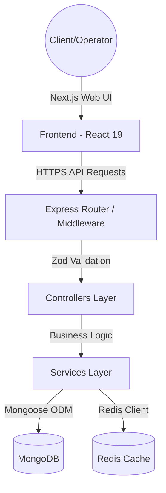

# LogiOpen System Design & Architecture

This document details the core architectural patterns, data consistency models, security mechanisms, and performance strategies implemented in LogiOpen.

---

## 1. Architectural Overview

LogiOpen is structured as a decoupled monorepo containing a high-performance Express.js REST API backend and a Next.js 15 App Router frontend. The design strictly adheres to **Clean Architecture** principles, maintaining a clear separation of concerns across layers.

### Key Modules & Directories
* `backend/src/controllers/`: Receives HTTP requests, coordinates services, and structures responses.
* `backend/src/services/`: Contains pure domain logic (e.g., PDF generation, reporting, customer notification queues).
* `backend/src/models/`: Declares Mongoose schemas, database indexes, and middleware hooks.
* `backend/src/middleware/`: Global interceptors handling authorization, error boundary catch-blocks, and request throttling.

---

## 2. Data Consistency & ACID Transactions

In logistics operations, updating parcel states (e.g., booking to dispatch, arrival to delivery) requires multi-document updates. To prevent race conditions or partial failures (e.g., updating a booking status but failing to increment the branch load count):

* **Mongoose Sessions**: All state-changing multi-collection queries are wrapped in MongoDB ACID transactions using Mongoose sessions.
* **Rollback Mechanism**: If any database update fails during the transaction lifecycle, a full rollback triggers automatically to preserve integrity.
* **Auto-Increment Counters**: Sequential Lorry Receipt (LR) numbers are generated transactionally via a dedicated tracking collection to ensure no duplicate keys are issued during concurrent bookings.

---

## 3. Security Blueprint

LogiOpen implements a defense-in-depth model across the database, network, and application layers.

### A. Field-Level Encryption
To protect client and carrier personally identifiable information (PII) at rest:
* Cryptographic symmetric encryption (`mongoose-field-encryption`) is integrated into the database schema layer.
* Sensitive fields (e.g., payment details, phone numbers, recipient names) are encrypted before write-operations, ensuring data is unreadable in raw database dumps.

### B. Network & API Protections
We configure Express middleware to mitigate common OWASP Top 10 vulnerabilities:
* **HTTP Headers Security**: Configured via `helmet` to manage Content Security Policies (CSP) and block cross-site scripting (XSS).
* **NoSQL Injection Defenses**: Incoming payloads are sanitized through `express-mongo-sanitize` to strip operator queries containing potential database command injection patterns.
* **Distributed Rate Limiting**: The system implements `express-rate-limit` configurations on authentication and transactional routes to block automated brute-force attacks.

### C. Authentication & RBAC
* Dual-layered security using **NextAuth.js** on the frontend client and JWT validation on the backend API.
* Granular **Role-Based Access Control (RBAC)** limits branch operators to branch-specific data, while Super Admins hold global analytical visibility.

---

## 4. Performance & Scalability

### A. Cache-Aside Pattern with Redis
To sustain high concurrency loads and minimize database CPU overhead:
* **Distributed Caching**: A Redis client caches frequent, read-heavy query payloads (e.g., branch lookups, active routing tables).
* **Fault-Tolerant Fallback**: The client is built with a resilient connection pool. If Redis goes offline, the service automatically falls back to direct MongoDB queries without throwing errors or causing downtime.
* **Cache Invalidation**: Event-driven hooks invalidate stale cached keys immediately upon write operations.

### B. Optimistic UI Updates & SWR
On the client side, LogiOpen implements **SWR** (Stale-While-Revalidate) for HTTP caching:
* Revalidates data automatically in the background on window focus.
* Implements optimistic UI rendering, letting branch operators see updates instantly before the backend confirmation resolves.

---

## 5. Observability & Logging

### A. Distributed Request Tracing
To debug and monitor operations across concurrent delivery lifecycle events:
* **CLS-RTracer**: Automatically binds a unique Request UUID to the execution context of every incoming HTTP request.
* **Structured Logging**: Using Winston and Pino, log messages outputs automatically prepend the active Request UUID, letting developers filter logs globally for the complete path of any single operation.

---

## 6. Testing & Quality Assurance

* **Database Mocking**: We use `mongodb-memory-server` to run backend integration tests against a sandboxed in-memory database instance.
* **API Testing**: Endpoints are validated using `supertest` to trigger programmatic HTTP requests and check response assertions.
* **Continuous Integration**: The repo triggers automated test execution, dependency lint checks, and container vulnerability scans on every push.
