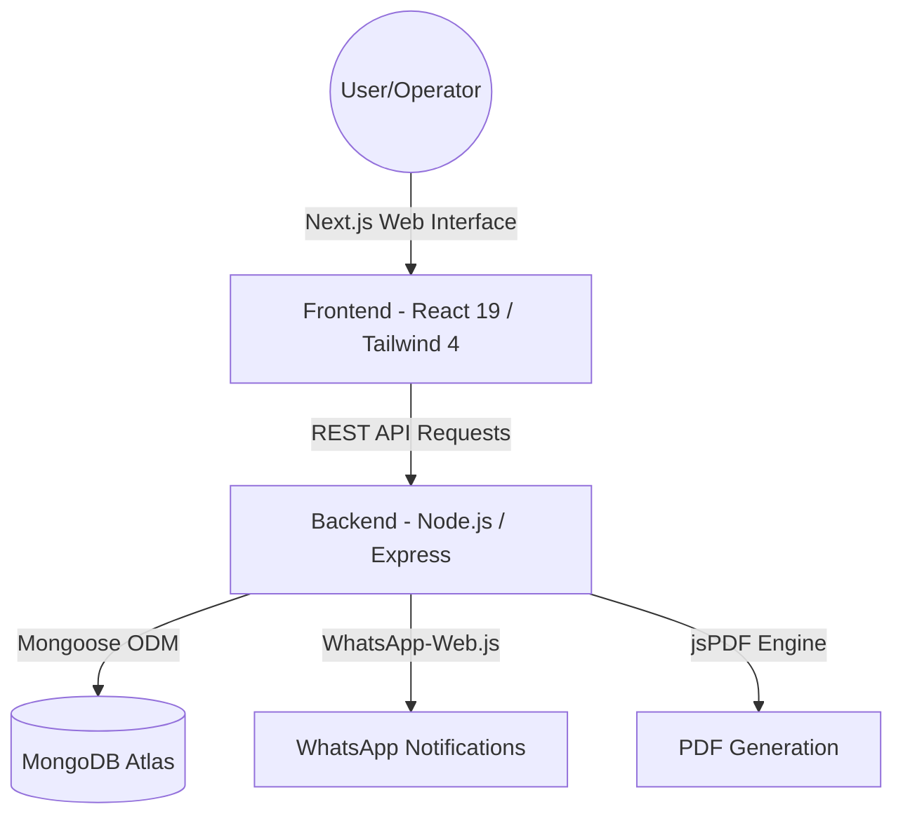
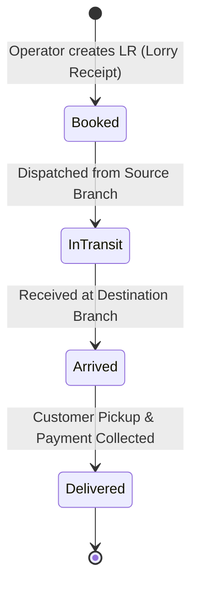

# 🚚 LogiOpen — Open-Source Logistics & Branch Operations Platform

Welcome to **LogiOpen**, an enterprise-grade, open-source multi-tenant Logistics ERP system designed to democratize access to supply chain software. LogiOpen empowers transport companies and carriers with real-time parcel tracking, automated digital invoicing (PDF generation), role-based branch isolation, and instant customer notification workflows.

---

## 🏗️ System Architecture

LogiOpen is designed as a modular monorepo, keeping client-side UI and backend REST APIs separate, flexible, and scalable.



> 📖 **Architecture & Deep Dive**: For a technical breakdown of our database transaction safety (ACID), field-level database encryption, Redis cache-aside implementation, and API security structures, check out our [System Design & Architecture Guide](ARCHITECTURE.md).

---

## 📦 Parcel Lifecycle Flow

LogiOpen coordinates the physical and digital transition of parcels from pickup to delivery.



---

## ✨ Key Features

- 🏢 **Multi-Tenant / Multi-Branch Isolation**: Clean data visibility boundaries configured for Super Admins and Branch Operators.
- 🔐 **Role-Based Access Control (RBAC)**: Secure access paths and settings isolation for administrator and counter operators.
- 📦 **End-to-End Parcel Management**: Intuitive booking creation, inbound sorting, and delivery pickup workflows.
- 📊 **Real-time Performance Dashboards**: Dynamic operational insights, including revenue statistics, load balances, and transaction logs.
- 📱 **Fully Responsive Interface**: Runs smoothly across desktop screens and warehouse mobile devices.
- 🖨️ **Digital PDF "Builty" Generation**: Instantly produces Lorry Receipts and daily reports on-demand.
- 💬 **WhatsApp Notification Hooks**: Automates shipping alerts directly to customer phones upon booking and arrival.

---

## 🛠️ Tech Stack

### Frontend
- **Framework**: Next.js 15 (App Router)
- **UI Library**: React 19 + Radix UI Components
- **Styling**: Tailwind CSS v4
- **State Management**: Zustand
- **Data Fetching**: SWR (Stale-While-Revalidate)

### Backend
- **Runtime & Framework**: Node.js + Express.js
- **Database**: MongoDB (Mongoose ODM)
- **Authentication**: NextAuth.js
- **Services**: WhatsApp-web.js API integration, Winston logger

---

## 🚀 Getting Started

Follow these steps to set up and run LogiOpen locally for development and testing:

### Prerequisites
- **Node.js**: v18.0.0 or higher
- **MongoDB**: Local community server or a MongoDB Atlas cloud instance

### 1. Installation
Clone the repository and install all dependencies for both frontend and backend:
```bash
# Install root, backend, and frontend dependencies
npm install
```

### 2. Configure Environment Variables
Create local environment files to connect to your local or cloud database:

**For Frontend (`frontend/.env`)**:
```env
NEXT_PUBLIC_API_URL=/api
AUTH_SECRET=your_nextauth_secret_key
NEXTAUTH_URL=http://localhost:3000
AUTH_TRUST_HOST=true
```

**For Backend (`backend/.env`)**:
```env
PORT=3001
MONGODB_URI=mongodb://localhost:27017/parcel_system_hackathon
JWT_SECRET=your_jwt_secret_key
SMS_API_KEY=your_sms_gateway_key
```

### 3. Initialize and Seed Database
Run the pre-configured seed script to set up default branches and create the initial **Super Admin** account:
```bash
npm run db:reset
```

Default credentials generated:
- **Username**: `admin`
- **Password**: `admin123`

### 4. Run Development Servers
Start both the Next.js frontend and Express backend concurrently:
```bash
npm run dev
```
The frontend will start on [http://localhost:3000](http://localhost:3000) and backend on [http://localhost:3001](http://localhost:3001).
