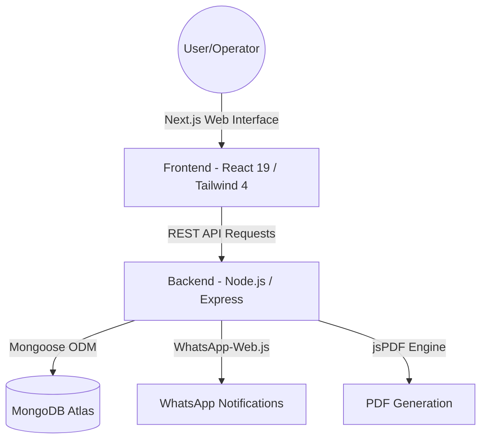
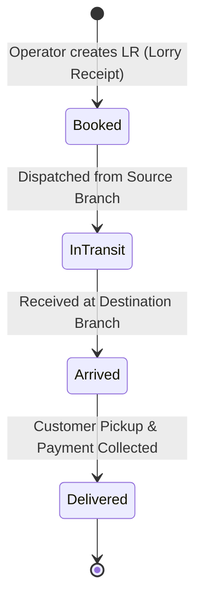

# 🚚 LogiOpen — Open-Source Logistics & Branch Operations Platform

Welcome to **LogiOpen**, an open-source, multi-tenant Logistics ERP system designed to democratize access to enterprise-grade supply chain software. LogiOpen empowers small-to-medium transport companies and local carriers with real-time parcel tracking, automated digital invoicing, and multi-branch operations.

This project was built and submitted as part of the **Open Innovation Hackathon** to solve fragmentation, high licensing barriers, and paper waste in regional logistics networks.

---

## 💡 The Open Innovation Vision

Traditional logistics systems are proprietary, closed off, and expensive, preventing local and regional transporters from digitizing their operations. **LogiOpen** solves this through:
1. **Democratization of Tech**: A self-hostable, multi-tenant platform that any local carrier can deploy out-of-the-box.
2. **Open APIs & Interoperability**: Built with a REST-first architecture, allowing local merchants, e-commerce sites, and other shipping hubs to query tracking details and insert bookings.
3. **Eco-Friendly Supply Chain**: Fully digital "Builty" (PDF receipts) and automated customer tracking notifications (via WhatsApp) to move local freight operations toward a zero-paper future.

---

## 🏗️ System Architecture

LogiOpen is designed as a modular monorepo, keeping client-side UI and backend APIs separate and flexible.



---

## 📦 Parcel Lifecycle Flow

LogiOpen coordinates the physical and digital transition of parcels from pickup to delivery.



---

## ✨ Key Features

- 🏢 **Multi-Tenant / Multi-Branch isolation**: Clean role-based data visibility configured for Super Admins and Branch Operators.
- 🔐 **Role-Based Access Control (RBAC)**: Secure access paths and settings isolation for administrators and counter operators.
- 📦 **End-to-End Parcel Management**: Intuitive booking creation, inbound sorting, and delivery pickup dispatch workflows.
- 📊 **Real-time Performance Dashboards**: Dynamic operational insights, including revenue statistics, load balances, and transaction tracking.
- 📱 **Fully Responsive Mobile Interface**: Operates seamlessly across desktop screens and warehouse mobile devices.
- 🖨️ **Digital PDF "Builty" Generation**: Instantly produces Lorry Receipts and daily reports on-demand.
- 💬 **WhatsApp Notification Hooks**: Automates shipping alerts directly to customer phones upon booking and arrival.

---

## 🛠️ Tech Stack

### Frontend
- **Framework**: Next.js 15 (App Router)
- **UI Library**: React 19 + Radix UI Components
- **Styling**: Tailwind CSS v4
- **State Management**: Zustand
- **Data Fetching**: SWR (Stale-While-Revalidate)

### Backend
- **Runtime & Framework**: Node.js + Express.js
- **Database**: MongoDB (Mongoose ODM)
- **Authentication**: NextAuth.js
- **Services**: WhatsApp-web.js API integration, Winston logger

---

## 🚀 Getting Started

Follow these steps to set up and run LogiOpen locally for development and testing:

### Prerequisites
- **Node.js**: v18.0.0 or higher
- **MongoDB**: Local community server or a MongoDB Atlas cloud instance

### 1. Installation
Clone the repository and install all dependencies for both frontend and backend:
```bash
# Install root, backend, and frontend dependencies
npm install
```

### 2. Configure Environment Variables
Create a `.env` or `.env.local` file to connect to your local or cloud database:

**For Frontend (`frontend/.env`)**:
```env
NEXT_PUBLIC_API_URL=/api
AUTH_SECRET=your_nextauth_secret_key
NEXTAUTH_URL=http://localhost:3000
AUTH_TRUST_HOST=true
```

**For Backend (`backend/.env`)**:
```env
PORT=3001
MONGODB_URI=mongodb://localhost:27017/parcel_system_hackathon
JWT_SECRET=your_jwt_secret_key
SMS_API_KEY=your_sms_gateway_key
```

### 3. Initialize and Seed Database
Run the pre-configured seed script to set up default branches and create the initial **Super Admin** account:
```bash
npm run db:reset
```

Default credentials generated:
- **Username**: `admin`
- **Password**: `admin123`

### 4. Run Development Servers
Start both the Next.js frontend and Express backend concurrently:
```bash
npm run dev
```
The frontend will start on [http://localhost:3000](http://localhost:3000) and backend on [http://localhost:3001](http://localhost:3001).

---

## 📄 License & Submissions

Submitting under the team **HackDevengers**. LogiOpen is open-source and free for non-profit and commercial use.
