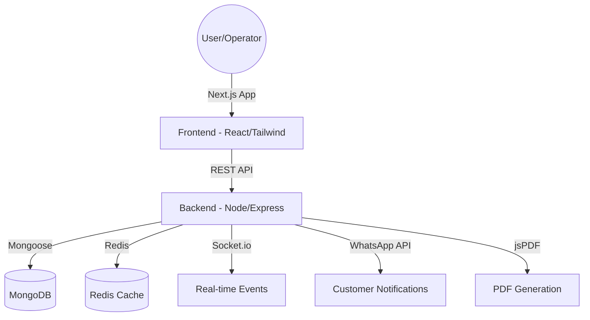
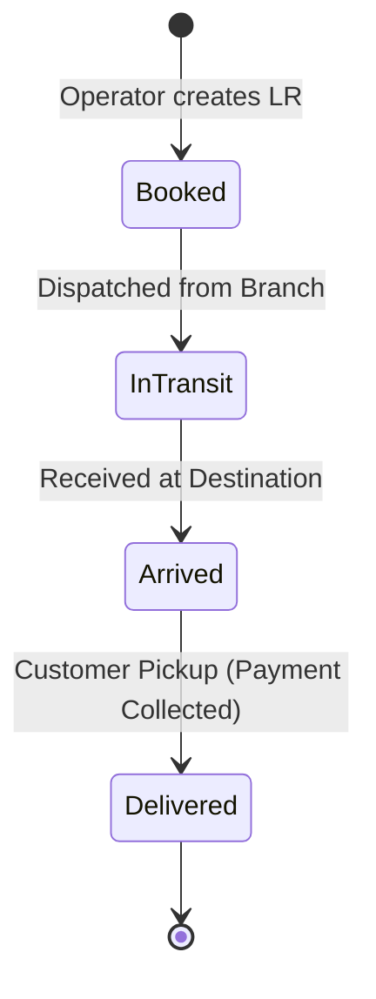

# 🚚 ABCD Logistics Platform (Enterprise Edition)


[](https://nextjs.org/)
[](https://reactjs.org/)
[](https://www.mongodb.com/)
[](https://tailwindcss.com/)

A comprehensive, multi-tenant Logistics ERP system designed for high-volume transport companies. Manage bookings, inventory, and branch operations with real-time tracking and automated reporting.

---

## 🏗️ System Architecture



---

## 📦 Parcel Lifecycle



---

## ✨ Key Features

- 🏢 **Multi-Tenant / Multi-Branch**: Centralized management with branch-specific isolation.
- 🔐 **Role-Based Access Control (RBAC)**: Secure access for Super Admins and Branch Admins.
- 📦 **End-to-End Booking**: Streamlined parcel entry, inbound reception, and final delivery workflows.
- 📊 **Real-time Analytics**: Live revenue reports, load tracking, and system health monitoring.
- 📱 **Mobile Responsive**: Fully optimized for both desktop and mobile operations.
- 🖨️ **Automated Documentation**: Instant PDF generation for "Builty" (Receipts) and Reports.
- 💬 **WhatsApp Integration**: Automated notifications for customers (Inbound/Delivery).
- 🔍 **LR Tracking**: Advanced search and filtering by LR Number, Date, or Customer.

---

## 🛠️ Tech Stack

### Frontend
- **Framework**: Next.js 15 (App Router)
- **UI Library**: React 19 + Radix UI
- **Styling**: Tailwind CSS 4
- **Icons**: Lucide React
- **State Management**: Zustand
- **Data Fetching**: SWR

### Backend
- **Framework**: Node.js + Express.js
- **Database**: MongoDB (Mongoose)
- **Caching**: Redis (Optional)
- **Authentication**: NextAuth.js
- **Utils**: WhatsApp-web.js, Speakeasy (2FA), Winston (Logging)

---

## 🔗 REST API Reference

| Endpoint | Method | Description | Role Required |
| :--- | :---: | :--- | :--- |
| `/api/auth/login` | `POST` | Authenticate user and create session | Guest |
| `/api/booking` | `POST` | Create a new parcel booking (LR) | Admin |
| `/api/booking/:id` | `GET` | Get details for a specific parcel | Admin |
| `/api/branch` | `GET` | List all available branches | Super Admin |
| `/api/analytics/revenue`| `GET` | Get revenue statistics | Super Admin |
| `/api/whatsapp/send` | `POST` | Manually trigger notification | Admin |

> [!TIP]
> Full API documentation is available via Postman collection in `/docs/api_collection.json`.

---

## 🚀 Getting Started

### Prerequisites
- **Node.js**: v18.0.0 or higher.
- **MongoDB**: v6.0+ (Local or Atlas).
- **Redis**: v7.0+ (Optional, for caching).
- **WhatsApp Web**: A dedicated device for `whatsapp-web.js` session.

### Environment Setup

Create a `.env.local` file in the root:

```env
# Database
MONGODB_URI=mongodb://...

# Authentication
AUTH_SECRET=your_nextauth_secret
NEXTAUTH_URL=http://localhost:3000

# Integrations
WHATSAPP_SESSION_ID=parcel_system_main
```

### Installation & Run

```bash
# 1. Install dependencies (monorepo)
npm install

# 2. Seed initial branches/users
npm run db:reset

# 3. Start development environment
npm run dev
```

---

## 📂 Project Structure

```text
├── frontend/           # Next.js 15 App Router application
│   ├── src/components/ # Shared UI components (Radix/Lucide)
│   ├── src/lib/store/  # Zustand state management
│   └── src/app/        # Pages and API handlers
├── backend/            # Express.js REST API server
│   ├── src/models/     # Mongoose schemas
│   ├── src/services/   # Business logic (WhatsApp, reporting)
│   └── src/routes/     # API endpoint definitions
└── docs/               # Manuals, diagrams, and QA checklists
```

---

## 🛠️ Troubleshooting

| Issue | Cause | Solution |
| :--- | :--- | :--- |
| **Auth Fail** | Invalid `AUTH_SECRET` | Reset `AUTH_SECRET` in `.env.local`. |
| **No DB Conn** | IP not whitelisted | Check MongoDB Atlas Network Access. |
| **WhatsApp Error** | session expired | Restart backend and scan QR from logs. |
| **Build Fail** | Node version mismatch | Use `nvm use 20` or higher. |

---

## 👥 User Roles

- **Super Admin**: System configuration, branch management, global reports, and security.
- **Admin**: Branch-level operations, booking management, and inbound/outbound tracking.

---

## 📄 License & Support

Part of the **ABCD Logistics Ecosystem**. For enterprise support or custom integration, please contact the development team.
